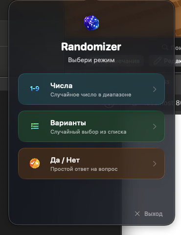
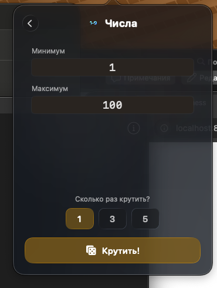
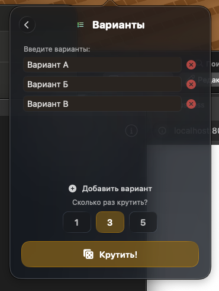
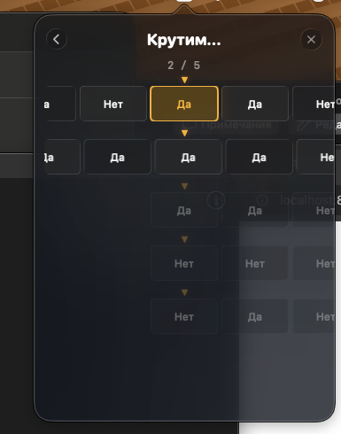
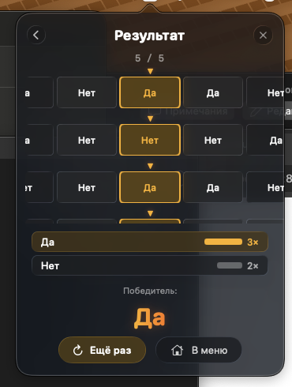

# Randomizer

A sleek macOS menu bar randomizer app with CS:GO-style carousel animations and Liquid Glass effects.

Lives in your menu bar, always one click away. Pick a mode, spin the wheel, get your result.

<p align="center">
  
  
  
</p>

<p align="center">
  
  
</p>

## Features

- **Numbers** --- random number in a range (min/max)
- **Options** --- random pick from a custom list of variants
- **Yes / No** --- simple coin-flip answer
- **Multi-spin** (1 / 3 / 5) --- run sequential carousels and pick the most frequent result
- **CS:GO-style carousel** animation with smooth ease-out deceleration
- **Liquid Glass** UI effects (macOS 26 Tahoe)
- **Translucent popover** --- see your desktop through the app
- Runs entirely in the menu bar --- no Dock icon

## Requirements

- **macOS 26 (Tahoe)** or later
- **Swift 6.2** / Xcode 26+

## Installation

### Download DMG

Download the latest `.dmg` from [Releases](../../releases), open it, and drag **Randomizer** to Applications.

### Build from Source

```bash
git clone https://github.com/YOUR_USERNAME/Randomizer.git
cd Randomizer
swift build -c release
```

The built binary will be at `.build/release/Randomizer`. Run it directly or wrap it into an `.app` bundle (see below).

### Run in Development

```bash
swift run
```

## How It Works

1. Click the dice icon in the menu bar
2. Choose a mode: **Numbers**, **Options**, or **Yes/No**
3. Configure settings (range, variants, spin count)
4. Hit **Spin!** and watch the carousel
5. See your result with stats breakdown (for multi-spin)

## Tech Stack

- **Swift** + **SwiftUI** (native macOS)
- **NSStatusItem** + **NSPopover** for menu bar integration
- **Liquid Glass** (.glassEffect API) for modern translucent UI
- **Swift Package Manager** for build & dependencies
- Custom carousel animation with `timingCurve` easing

## Project Structure

```
Sources/Randomizer/
  main.swift              # Entry point (agent app, no Dock icon)
  AppDelegate.swift       # NSStatusItem + NSPopover setup
  ContentView.swift       # Root navigation, state, brand colors
  ModeSelectScreen.swift  # Mode selection cards
  ModeConfigScreen.swift  # Mode settings + spin count picker
  SpinnerScreen.swift     # Carousel animation + results
  Resources/              # App icons (PNG)
```

## License

MIT --- see [LICENSE](LICENSE) for details.
